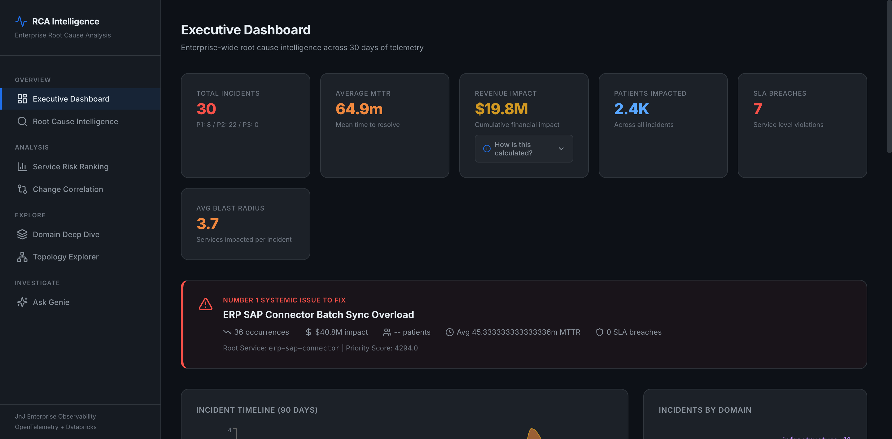
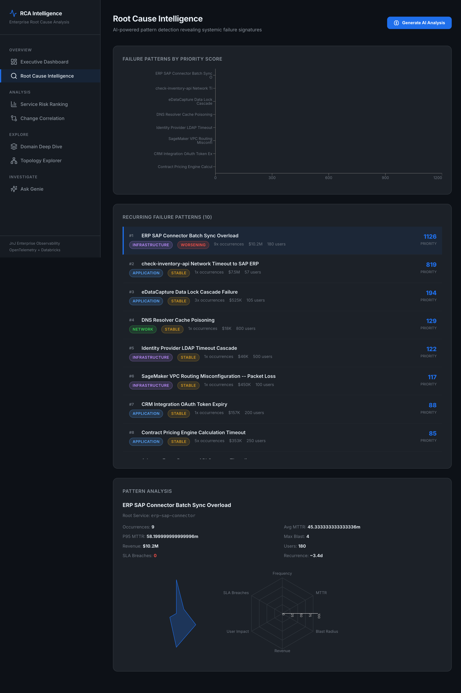
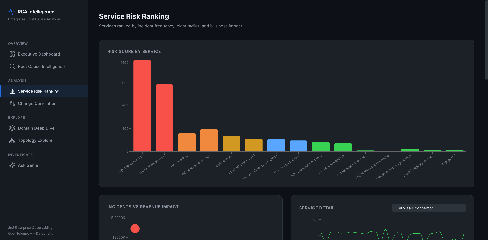
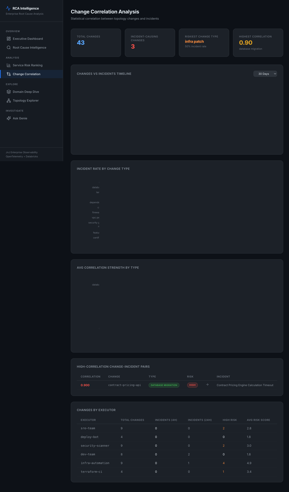
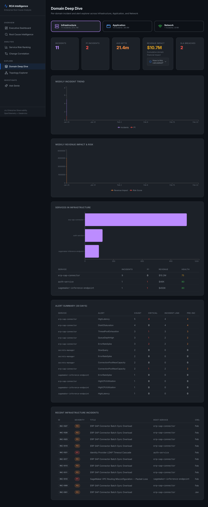
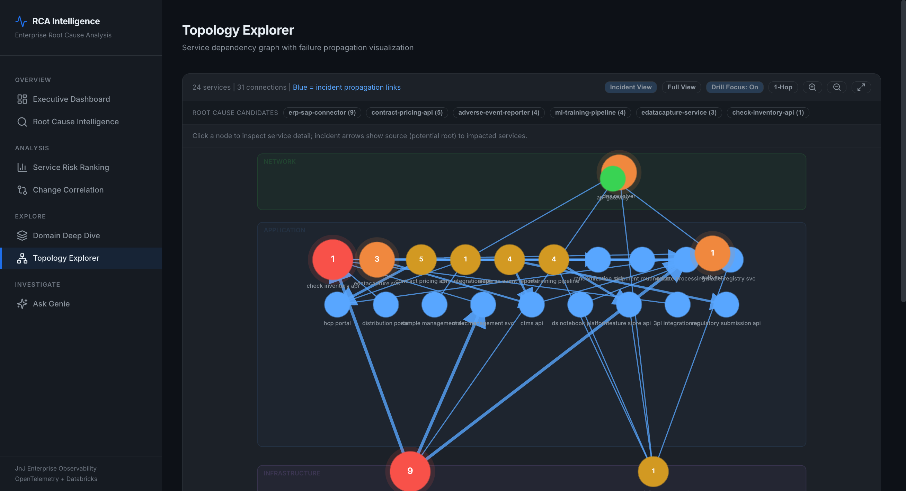
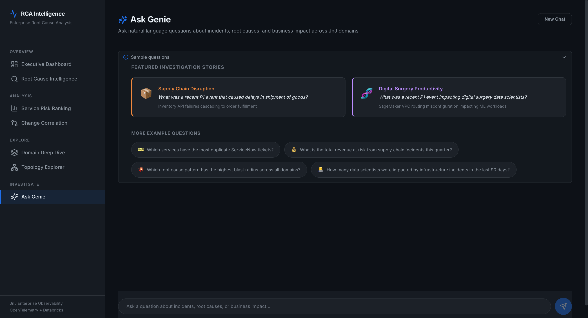

# Enterprise RCA Intelligence Demo Talk Track

This talk track walks through each page in the app and explains what to say while presenting the visuals!

## 1) Executive Dashboard

**Narrative**
- Start with the executive lens: overall incident volume, severity mix, MTTR, revenue impact, and patient impact.
- Call out the "Number 1 Systemic Issue to Fix" panel as the top remediation target.
- Use the timeline and domain distribution visuals to explain where reliability pressure is concentrated over time.
- Close on the new ServiceNow ticket noise table to show operational burden from duplicate tickets.

**Key visual callouts**
- Top KPI cards (incidents, MTTR, revenue impact, SLA breaches).
- Top systemic issue callout card.
- Incident timeline and domain pie chart.
- Domain impact summary + ServiceNow duplicate-ticket table.

## 2) Root Cause Intelligence

**Narrative**
- Explain that this page ranks recurring failure patterns by priority score (frequency x impact).
- Select one pattern and describe its operational profile (MTTR, blast radius, revenue impact, patient impact).
- Use the radar chart to compare impact dimensions quickly.
- Optionally run AI analysis for a narrative remediation plan.

**Key visual callouts**
- Horizontal priority ranking chart.
- Pattern list with trend labels (improving/stable/worsening).
- Pattern detail panel and radar profile.

## 3) Service Risk Ranking

**Narrative**
- Shift from pattern-centric to service-centric risk.
- Show how services are prioritized using incident frequency, blast radius, and business impact.
- Use the scatter plot to identify "high incidents + high revenue impact" outliers.
- Drill into a single service to discuss health trends and recent incident behavior.

**Key visual callouts**
- Risk score bar chart (top services).
- Incidents vs revenue bubble chart.
- Full ranking table for operational prioritization.

## 4) Change Correlation

**Narrative**
- Position this page as change-risk attribution: which changes are followed by incidents.
- Show incident-causing change rate by change type and average correlation strength.
- Use high-correlation pairs to discuss likely causal links and preventive controls.
- Close with executor-level table to identify process or team-level reliability patterns.

**Key visual callouts**
- Changes vs incidents timeline.
- Incident rate by change type.
- Correlation strength chart and high-correlation table.
- Changes by executor summary.

## 5) Domain Deep Dive

**Narrative**
- Explain this as the tactical view for domain owners (Infrastructure, Application, Network).
- Select a domain and show its incident trend, revenue/risk trend, service-level risk, and alert profile.
- Use the revenue impact explainer to clarify how impact is estimated.
- End on recent incidents to connect trend analytics to concrete events.

**Key visual callouts**
- Domain selector tiles with incident + revenue totals.
- Domain KPI strip (incidents, P1, MTTR, revenue impact, SLA breaches).
- Weekly incident and revenue/risk trend charts.
- Service and alert detail tables.

## 6) Topology Explorer

**Narrative**
- Describe this as blast-radius and propagation context.
- Explain node semantics: color for risk/domain, size/intensity for risk level.
- Explain edge semantics: red dashed lines indicate anomalous traffic paths.
- Click a node to review service details and connected dependencies.

**Key visual callouts**
- Domain zones (network/application/infrastructure).
- Risk-encoded node and edge styling.
- Node detail side panel and legend.

## 7) Ask Genie

**Narrative**
- Present Genie as the natural-language layer for ad hoc investigation.
- Start with a sample question to accelerate time-to-insight.
- Show generated SQL and supporting data to reinforce explainability.
- Highlight ticket-noise and business-impact prompts for stakeholder-specific Q&A.

**Key visual callouts**
- Collapsible sample question panel.
- Chat workflow with question, answer, SQL, and tabular evidence.

## Suggested Demo Flow (7-10 minutes)

1. Executive Dashboard (business context and top risk)
2. Root Cause Intelligence (pattern-level diagnosis)
3. Service Risk Ranking (service prioritization)
4. Change Correlation (likely causality from changes)
5. Domain Deep Dive (owner-level operational action)
6. Topology Explorer (dependency and blast-radius context)
7. Ask Genie (self-serve investigation and follow-up questions)
